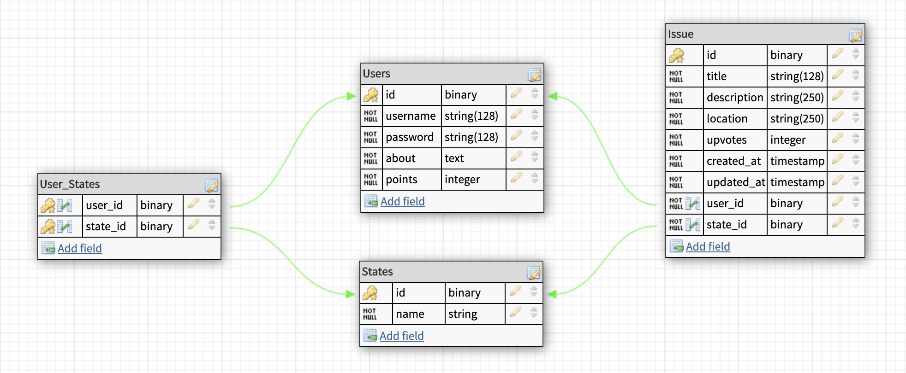

# Co-make

# Table Diagram


# Models
## Users
```js
{
    username: string, // Required
    password: string, // Required
    about: text, // Required
    points: integer // Required
}
```
## Issues
```js
{
    title: string, // Required
    description: string, // Required
    location: string, // Required
    upvotes: integer, // Defaults to 0
    user_id: integer, // Foreign key required
    state_id: integer // Foreign key required
}
```
## States
```js
{
    name: string, // Required
}
```
# Endpoints
## Users
| Request Type | Endpoint                       | Description               |
|:------------:|:------------------------------:|:-------------------------:|
| POST         | /api/auth/register             | Creates User              |
| POST         | /api/auth/login                | Creates JWT               |
| GET          | /api/users                     | Returns All Users         |
| GET          | /api/users/:id                 | Returns User By ID        |
| PUT          | /api/users/:id                 | Update User               |
| DELETE       | /api/users/:id                 | Remove User               |
| GET          | /api/users/:id/states          | Returns User states       |
| POST         | /api/users/:id/states          | Add state to user         |
## States
| Request Type | Endpoint                       | Description               |
|:------------:|:------------------------------:|:-------------------------:|
| GET          | /api/states                    | Returns all states        |
| GET          | /api/states/:id                | Returns state by ID       |
| GET          | /api/states/:id/issues         | Returns all state issues  |
| GET          | /api/states/:id/issues/:id     | Returns state issue by ID |
| POST         | /api/states/:id/issues         | Create issue for state    |
| DELETE       | /api/states/:id/issues/:id     | Remove issue from state   |
| PUT          | /api/states/:id/issues/:id     | Updates issue from state  |
## Issues
| Request Type | Endpoint                       | Description               |
|:------------:|:------------------------------:|:-------------------------:|
| GET          | /api/issues                    | Returns all issues        |
| GET          | /api/issues/:id                | Returns issue by ID       |

# API
## Auth routes
----------------
### POST `/api/auth/register`

**Expects the following shape**
```js
{
    username: string,
    password: string
}
```
### POST `/api/auth/login`

**Expects the following shape**
```js
{
    username: string,
    password: string
}
```
## User routes
----------------
### GET `/api/users`
- Returns all users in database
```js
[
    {
        id: 1,
        username: "Mario",
        points: 0,
        about: "I enjoy long walks on the beach."
    },
    {
        id: 2,
        username: "Sara",
        points: 0,
        about: "I travel all around the United States looking for adventure"
    },
    {
        id: 3,
        username: "Bob",
        points: 0,
        about: "I drive my Miata up and down the east coast weekly."
    },
]
```
### GET `/api/users/:id`
- Returns user with matching id
```js
{
    id: 1,
    username: "Mario",
    points: 0,
    about: "I enjoy long walks on the beach."
}
```
### PUT `/api/users/:id`
- Updates user information
- **Do not** modify password

**Expects the following shape :**
```js
{
    username: string,
    points: integer,
    about: text
}
```
### DELETE `/api/users/:id`
- Removes user with matching id
- Returns special message
```js
{
    message: "You deleted <username>"
}
```

## State routes
----------------
### GET `/api/states`
- Returns an array of all states
```js
[
    {
        id: 1,
        name: "Alabama"
    },
    {
        id: 2,
        name: "Alaska"
    },
    {
        id: 3,
        name: "Arizona"
    },
]
```
### GET `/api/states/:id`
- Returns state with matching id
```js
{
    id: 29,
    name: "New Hampshire"
}
```

## Issue routes
----------------
### GET `/api/issues`
- Returns an array of all issues everywhere
```js
[
    {
        id: 16,
        title: "No complaints",
        description: "I just came here to just say that the fried chicken at the Puritan Backroom is delicious!",
        location: "Manchester",
        upvoted: 0,
        created_at: "2020-03-03T15:42:35.153Z",
        updated_at: "2020-03-03T15:42:35.153Z",
        user_id: 3,
        state_id: 29
    },
    {
        id: 17,
        title: "Bicycles",
        description: "There needs to be more bicycle lanes downtown. I am too affraid to ride because cars never give me enough room",
        location: "Manchester",
        upvotes: 0,
        created_at: "2020-03-03T15:42:35.153Z",
        updated_at: "2020-03-03T15:42:35.153Z",
        user_id: 3,
        state_id: 29
    },
]
```
### GET `/api/issues/:id`
- Returns issue with matching id
```js
{
    id: 5,
    title: "Dirty Beach",
    description: "There is so much litter on the Cape, it's disgraceful!",
    location: "Cape Code",
    upvotes: 0,
    created_at: "2020-03-03T15:42:35.153Z",
    updated_at: "2020-03-03T15:42:35.153Z",
    user_id: 1,
    state_id: 21
}
```
### GET `/api/states/:id/issues`
- Returns an array of all issues for a specified state
```js
[
    {
        id: 1,
        title: "Potholes",
        description: "There is a huge pothole on Interstate 95. It blew out my tire!",
        location: "Interstate 95 south, mile marker 421",
        upvotes: 0,
        user_id: 2,
        created_at: "2020-03-03T15:42:35.153Z",
        updated_at: "2020-03-03T15:42:35.153Z"
    },
    {
        id: 2,
        title: "Construction",
        description: "There has been construction going on outside my house for weeks. This needs to stop!",
        location: "456 Elm street, Winchester",
        upvotes: 0,
        user_id: 2,
        created_at: "2020-03-03T15:42:35.153Z",
        updated_at: "2020-03-03T15:42:35.153Z"
    },
]
```

### GET `/api/states/:id/issues/:id`
- Returns issue with matching id for a specified state
```js
{
    id: 4,
    title: "Train issues",
    description: "The train going into Boston is filthy. We really need someone to clean it periodically. I once sat on someone's leftover jelly donut. Ruined my new pants",
    location: "29 Waterfield Rd, Winchester, MA 01890",
    upvotes: 0,
    created_at: "2020-03-03T15:42:35.153Z",
    updated_at: "2020-03-03T15:42:35.153Z",
    user_id: 2,
    state_id: 21
}
```
### POST `/api/states/:id/issues`
- Creates new issue for state
- Upvotes (not shown) will automatically be set to 0
- user_id and state_id will be set by back end 😁

**Expects the following shape :**
```js
{
    title: string,
    description: string,
    location: string,
    upvotes: integer
}
```
**Sends back new issue**
```js
{
    id: 18,
    title: "Your new title",
    description: "Your new description",
    location: "Your new location",
    upvotes: 0, 
    created_at: "2020-03-03T16:16:53.084Z",
    updated_at: "2020-03-03T16:16:53.084Z",
    user_id: 6, 
    state_id: 21
}
```
### DELETE `/api/states/:id/issues/:id`
- Removes issue from state
- Returns special message

### PUT `/api/states/:id/issues/:id`
- Updates issue with matching id for a specified state
- Update *at least* one field required

**Expects the following shape :**

```js
{
    title: string,
    description: string,
    location: string,
    upvotes: integer
}
```
**Sends back updated issue**
```js
{
    id: 18,
    title: "Your updated title",
    description: "Your updated description",
    location: "Your updated location",
    upvotes: 0,
    created_at: "2020-03-03T16:16:53.084Z",
    updated_at: "2020-03-03T16:16:53.084Z",
    user_id: 6,
    state_id: 21
}
```